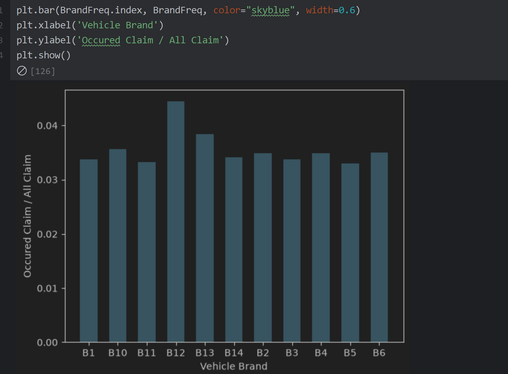
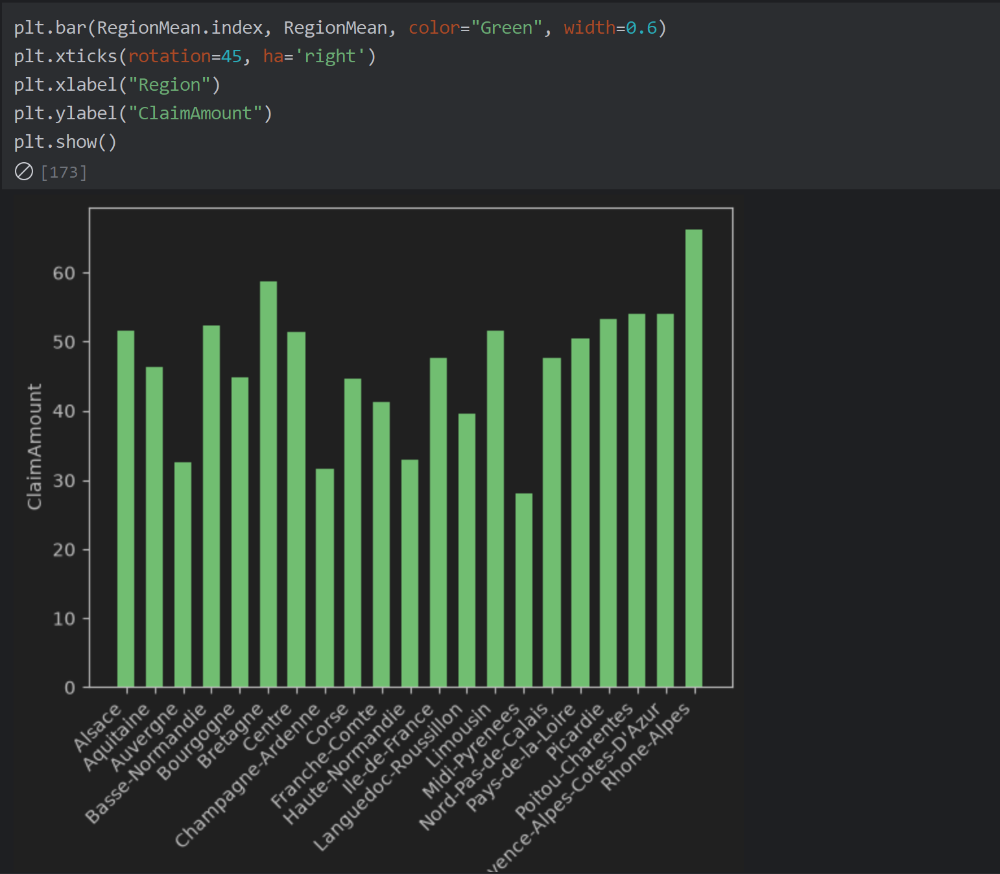
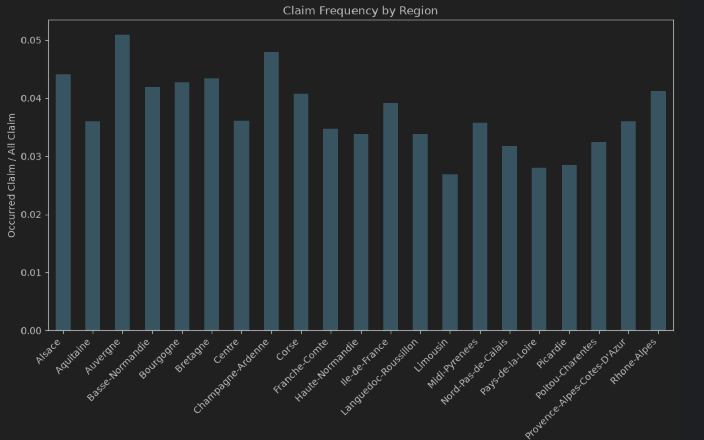
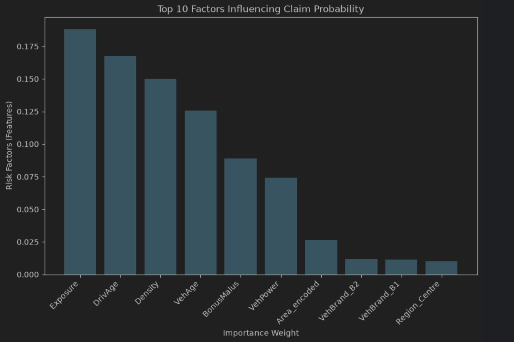

# Premium Prediction

A machine learning pipeline for predicting insurance **pure premiums** using a two-stage frequency-severity model, built on the French Motor Third-Party Liability (freMTPL2) claims dataset.

## Overview

Insurance pricing traditionally splits risk into two components:

- **Frequency** — the probability that a policyholder files a claim
- **Severity** — the expected claim amount, given that a claim occurs

This project models both components separately and combines them into a **pure premium** estimate (`Expected Frequency × Expected Severity`), which represents the expected cost of claims per policy.

## Data Pipeline

1. **Raw data**: `freMTPL2freq.csv` (policy/claim frequency data) and `freMTPL2sev.csv` (claim severity data) are loaded and pushed into a PostgreSQL database.
2. **SQL join**: A `Claim_Join` view (see [`ClaimDatabase.sql`](./ClaimDatabase.sql)) aggregates total claim amount per policy from `ClaimSev` and left-joins it onto `ClaimFreq`, producing one row per policy with a `ClaimAmount` column (0 if no claim).
3. **Feature engineering**:
   - One-hot encoding of `Region`, `VehBrand`, and `VehGas`
   - Ordinal encoding of `Area` (A–D → 0–3)
   - Claim severity capped at the 95th percentile to reduce the influence of extreme outliers

## Exploratory Analysis

- Distribution of claim amounts
- Claim frequency by vehicle brand (highest: **B12**)

  

- Average claim severity by region (highest: **Rhône-Alpes**)

  

- Claim frequency by region

  

## Modeling

Two Random Forest models form the pricing pipeline:

| Model | Type | Target | Purpose |
|---|---|---|---|
| `rf_freq` | `RandomForestClassifier` | `Claim_Status` (binary) | Predicts probability a policy has a claim |
| `rf_sev` | `RandomForestRegressor` | `ClaimAmount` (claims > 0 only) | Predicts claim severity, trained only on policies with claims |

**Pure Premium** = `freq_pred_prob × sev_pred`

## Results

- Evaluated using **MAE** and **RMSE** against actual claim amounts on the test set
- Predicted total premium compared against total actual claims, with an adjustment ratio applied to calibrate overall premium levels
- Feature importance analysis identifies the top risk factors driving claim probability — **Exposure**, **DrivAge**, and **Density** rank highest

  

## What I Learned

-**pandas**: data loading, merging, groupby aggregations, filtering, and get_dummies for one-hot encoding
-**SQLAlchemy**: connecting Python to PostgreSQL, pushing DataFrames to SQL with to_sql, and querying with read_sql
-**SQL**: writing views with CREATE OR REPLACE VIEW, CTEs (WITH), aggregation, and LEFT JOIN
-**scikit-learn**: train_test_split, RandomForestClassifier, RandomForestRegressor, and evaluation metrics (mean_absolute_error, mean_squared_error)
-**matplotlib**: bar charts, histograms, axis labeling, and rotated tick labels for readability
-**numpy**: percentile calculations for outlier capping
-**Python**: pandas, numpy, scikit-learn, matplotlib
-**Database**: PostgreSQL (via SQLAlchemy)
-**Modeling**: Random Forest (classification + regression)


- **Python**: pandas, numpy, scikit-learn, matplotlib
- **Database**: PostgreSQL (via SQLAlchemy)
- **Modeling**: Random Forest (classification + regression)

## Project Structure

```
├── ClaimDatabase.sql        # SQL view joining frequency and severity claim tables
├── Claim_Prediciton.ipynb   # Full analysis and modeling notebook
├── images/                  # Exported charts embedded in this README
└── README.md
```

## Setup

1. Load `freMTPL2freq.csv` and `freMTPL2sev.csv` into a PostgreSQL database
2. Run `ClaimDatabase.sql` to create the `Claim_Join` view
3. Run `Claim_Prediciton.ipynb` to reproduce the encoding, EDA, and modeling pipeline

## Notes

- This is a portfolio/learning project based on a public dataset (freMTPL2) and is not intended for production actuarial use.
